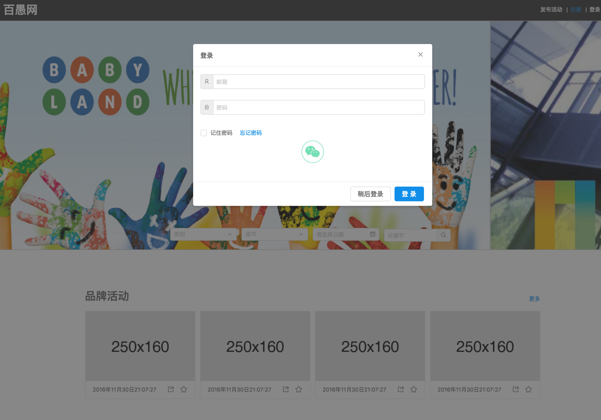

#百愚网Web项目设计规范

##一、.设计资源

###1. 设计尺寸

（1）max-width :100% 屏幕自适应

（2）min-width：1280px （建议设计稿尺寸）

（3）移动适配: width:750px （按比例缩放，web设计优先)  	  
 
###2. 设计基础

**(1) 字体**
 
 中文字体：
 
  
 
 英文字体：  
  
  
  
 字体使用规范：	(建议根据这个修改 )
  
   
   
**（2）排版**

涉及文案内容需考虑如下：

a.行高和段落

b.标点和空格

c.对齐

d.文案长度及长度不足后的显示方案 

**（3）动画**

a. 时长 

b. 动画前效果 

c. 动画后效果 

###3.设计资源	

  <a href="https://ant.design/docs/react/introduce-cn">antd组件库</a>
  
  <a href="https://github.com/ant-design/ant-design/releases/download/resource/Ant.Design.Template.v1.1.sketch">sketch素材库</a>
##二、当前实现

###1.Modal
	
(1) 登录:	

(2) 二次确认：

###2.ErrorHandler

###3.SuccessNotification

###4.FontIcon

<a href="https://ant.design/components/icon-cn/">Icon参考地址</a>

<a href="https://github.com/ant-design/ant-design/releases/download/resource/Ant.Design.Template.v1.1.sketch">相同素材库地址</a>

###5.Input

Normal:

focus:

error:

###6.Select

###7.DateTimePicker

###8.Uploader
 Img(All):
 
 
 
 Img(hover):
  
  
  
   
 
 Img(preView) 
 
 
	
 
 otherFile:
 
  

###9.CheckBox

  
  
  

###10.Spin

  

###11.Button

<a href="https://ant.design/components/button-cn/">Button参考设计</a> 需指定配色以及使用规范

###12.Tag  

<a href="https://ant.design/components/tag-cn/">Tag参考设计</a> 需指定配色以及使用规范
  
  

